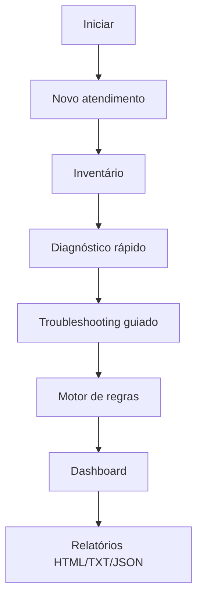

# Diagramas

```mermaid
flowchart TD
A[Iniciar] --> B[Novo atendimento]
B --> C[Inventário]
C --> D[Diagnóstico rápido]
D --> E[Troubleshooting guiado]
E --> F[Motor de regras]
F --> G[Dashboard]
G --> H[Relatórios HTML/TXT/JSON]
```
