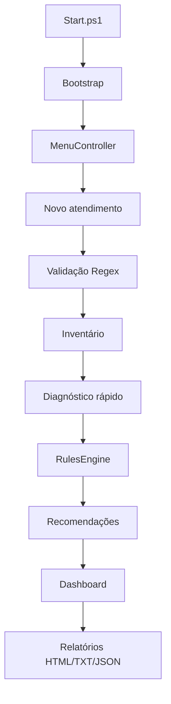
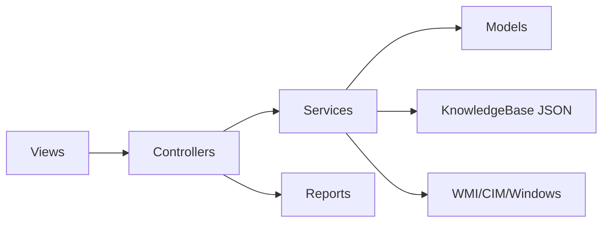

# Diagramas

## Fluxo principal



## MVC + Service Layer



## Caso de uso

```mermaid
usecaseDiagram
    actor Tecnico as "Técnico Field Service"
    Tecnico --> (Registrar atendimento)
    Tecnico --> (Executar inventário)
    Tecnico --> (Executar diagnóstico rápido)
    Tecnico --> (Seguir troubleshooting guiado)
    Tecnico --> (Visualizar dashboard)
    Tecnico --> (Gerar relatório)
```
