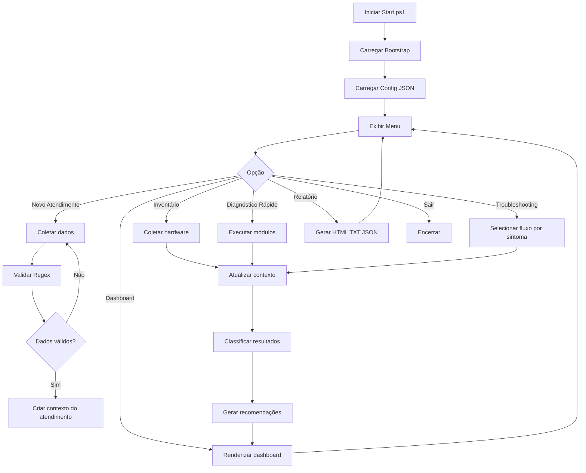
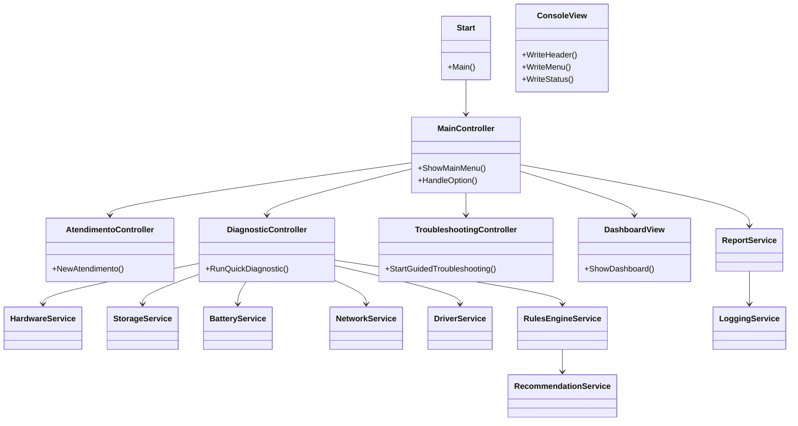
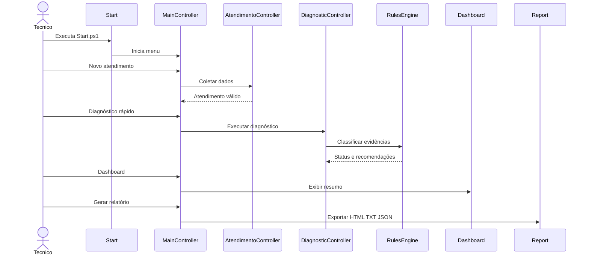

# Fluxogramas e Diagramas — FieldServiceSuite

## Fluxograma principal



## Caso de uso

```mermaid
usecaseDiagram
    actor Tecnico as "Técnico Field Service"

    Tecnico --> (Registrar atendimento)
    Tecnico --> (Executar inventário)
    Tecnico --> (Executar diagnóstico rápido)
    Tecnico --> (Seguir troubleshooting guiado)
    Tecnico --> (Preencher checklist)
    Tecnico --> (Visualizar dashboard)
    Tecnico --> (Gerar relatório)

    (Registrar atendimento) --> (Validar dados com Regex)
    (Executar diagnóstico rápido) --> (Classificar OK Atenção Crítico)
    (Seguir troubleshooting guiado) --> (Consultar fluxos JSON)
    (Classificar OK Atenção Crítico) --> (Gerar recomendações)
    (Gerar relatório) --> (Exportar HTML)
    (Gerar relatório) --> (Exportar TXT)
    (Gerar relatório) --> (Exportar JSON)
```

## Diagrama de módulos



## Sequência do atendimento


